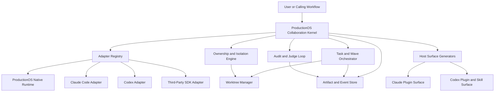
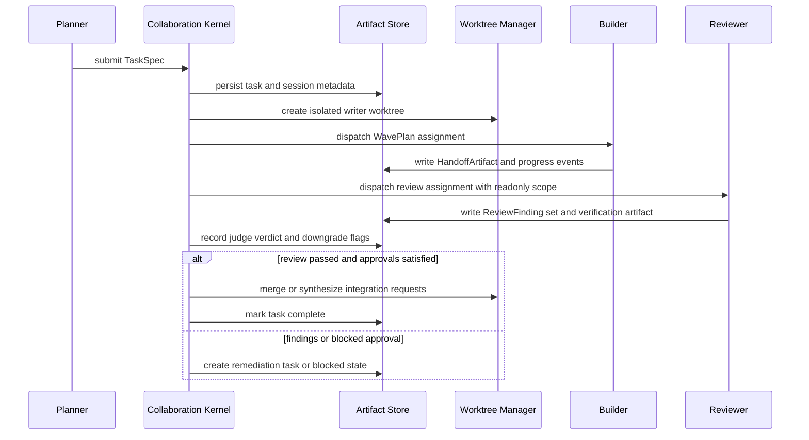
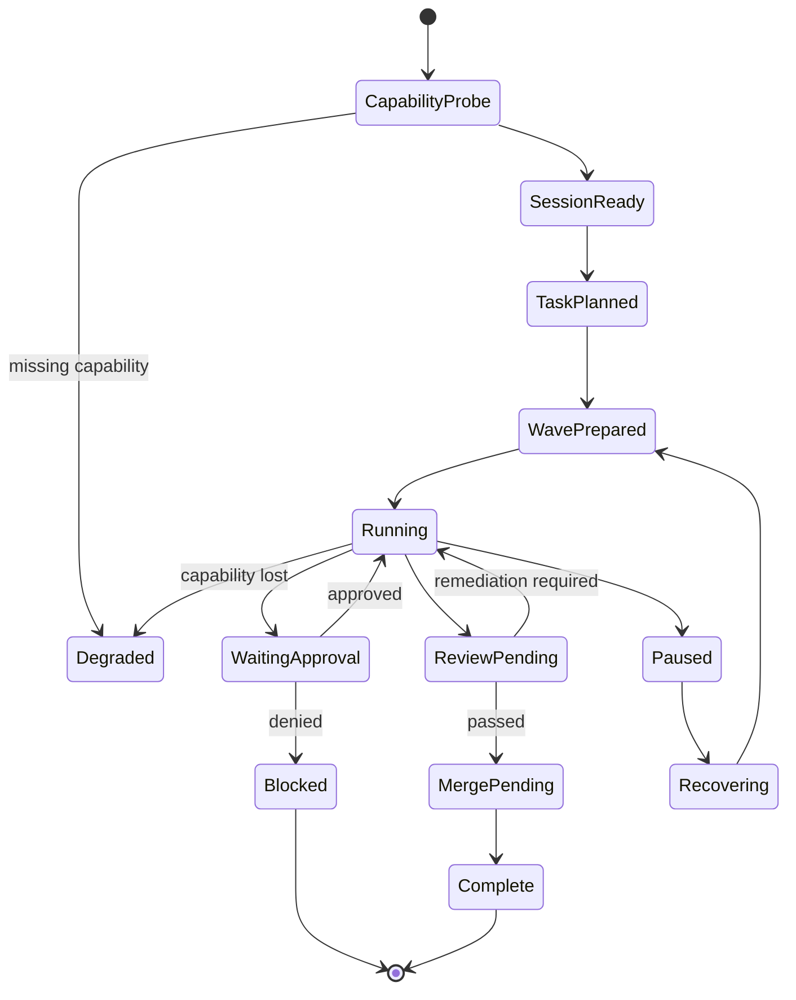

# Cross-Harness Collaboration Kernel SRS

Status: Draft for implementation
Date: 2026-04-11
Owner: ProductionOS
Scope: ProductionOS native harness mode, embedded layer mode, plugin mode, and adapter SDK mode

## Summary

This SRS defines a new ProductionOS capability: a provider-neutral collaboration kernel that lets ProductionOS operate in four separate modes from one shared architecture:

- `Native Harness Mode` - ProductionOS owns orchestration, state, audit, isolation, and merge control.
- `Embedded Layer Mode` - ProductionOS runs on top of an existing harness through an adapter and overlays orchestration, handoff, review, and state.
- `Plugin Mode` - ProductionOS exposes host-native entrypoints and manifests for Claude Code and Codex from shared kernel metadata.
- `Adapter SDK Mode` - a third-party harness integrates by implementing the published adapter contract without Claude- or Codex-specific assumptions.

The kernel is not a hidden shared chat between providers. Cross-provider collaboration is artifact-based, event-based, and auditable. Existing parity generation, worktree isolation, file ownership, broadcast channels, invocation rules, and handoff artifacts are reused as the baseline implementation primitives.

## Package Map

- [README.md](./README.md) - package index, branch inventory, and MIT-only normative reference policy
- [adapter-sdk.md](./adapter-sdk.md) - public adapter contract, capability model, lifecycle, and first-party adapter expectations
- [protocols.md](./protocols.md) - handoff, event, ownership, review, approval, and session schemas
- [compatibility-matrix.md](./compatibility-matrix.md) - per-mode feature support and degradation rules
- [traceability-matrix.md](./traceability-matrix.md) - goals, requirements, scenarios, and rollout gates crosswalk

## Evidence Baseline

This SRS is grounded in the current repo and branch surface:

- `README.md`
- `ARCHITECTURE.md`
- `docs/CODEX-PARITY-HANDOFF.md`
- `docs/RLM-INTEGRATION-SPEC.md`
- `scripts/lib/runtime-targets.ts`
- `scripts/lib/file-ownership.ts`
- `scripts/lib/broadcast.ts`
- `scripts/worktree-manager.ts`
- `templates/INVOCATION-PROTOCOL.md`
- `templates/SUB-AGENT-PROTOCOL.md`
- `tests/runtime-targets.test.ts`
- `tests/file-ownership.test.ts`
- `tests/worktree-integration.test.ts`
- `tests/broadcast.test.ts`
- `tests/hook-contracts.test.ts`

Remote design inputs checked on 2026-04-11:

- `codex/productionos-codex-parity`
- `refactor/canonical-plugin-structure`
- `feat/v8-sprint5-worktree-isolation`
- `feat/v8-sprint7-ownership-protocol`
- `docs/v8-handoff-todo`
- `sprint-9-infrastructure`

## Repository References And License Policy

Normative repository references for this package are restricted to the first-party `ShaheerKhawaja/ProductionOS` repository and its MIT license. The branch inputs above are all branches of the same repository. Comparative external repositories are intentionally excluded from normative implementation authority unless they are explicitly added with license verification and marked non-normative.

## Product Goals

- `CHC-G1` Provide one collaboration kernel that works across native, embedded, plugin, and SDK modes.
- `CHC-G2` Let Claude Code, Codex, and future harnesses collaborate on the same task with explicit handoffs and cross-audit.
- `CHC-G3` Preserve ProductionOS safety primitives: ownership scopes, worktree isolation, approval gates, and evaluator independence.
- `CHC-G4` Keep current Claude and Codex install surfaces working while moving authority to the runtime-neutral registry and adapter layer.
- `CHC-G5` Make the capability decision-complete enough that another engineer can implement adapters and protocols without inventing missing behavior.

## Operating Modes

| Mode | Who owns orchestration | Who owns session execution | Who owns host UX | Required adapter behavior |
|------|------------------------|----------------------------|------------------|---------------------------|
| Native Harness | ProductionOS | ProductionOS | ProductionOS | Optional host adapters for external providers |
| Embedded Layer | ProductionOS kernel | Host harness | Host harness | Full adapter required |
| Plugin | ProductionOS kernel and generated host surfaces | Host harness | Host harness | Host-native plugin/skill bridge required |
| Adapter SDK | ProductionOS kernel | Third-party harness | Third-party harness | SDK adapter required |

Rules:

- Modes are mutually exclusive at runtime for a given session.
- `Plugin Mode` is a specialization of `Embedded Layer Mode`, not a replacement for it.
- `Adapter SDK Mode` is the external contract used by non-Claude and non-Codex hosts.
- `Native Harness Mode` remains compatible with adapter-driven external participants.

## System Context

## Collaboration Sequence

## Lifecycle State Model

## Kernel Architecture

### Adapter Registry

The registry resolves the active runtime, loads the matching adapter, and exposes only declared capabilities to the orchestrator. No orchestration path may assume Claude-only or Codex-only behavior without a capability check.

Responsibilities:

- detect active runtime or requested runtime
- load adapter manifest and capability descriptor
- reject undeclared capabilities
- emit downgrade flags when required capabilities are unavailable

### Task and Wave Orchestrator

The orchestrator owns:

- `TaskSpec` creation and validation
- `WavePlan` generation and recursive re-dispatch
- role assignment across planner, builder, reviewer, judge, and approver
- stop conditions for success, plateau, and blocked states
- pause, resume, and crash recovery coordination

### Artifact and Event Store

The store is the canonical collaboration layer. Cross-provider state is never inferred from hidden chat history.

Canonical primitives:

- handoff artifacts
- findings artifacts
- approval records
- wave plans
- task/session records
- broadcast channels for progress, findings, requests, and alerts

### Ownership and Isolation Engine

This subsystem extends the current file ownership and worktree patterns into formal collaboration policy:

- default write isolation is `worktree`
- same-worktree collaboration is exception-only
- overlapping write scopes are forbidden
- readonly demotion and integration requests are mandatory when conflicts appear

### Audit and Judge Loop

The audit loop preserves the current ProductionOS independence principle:

- agents that evaluate must not approve their own modifications
- medium- and high-stakes flows require distinct review by another role or provider when available
- approvals are separate from implementation and review

### Host Surface Generators

Claude and Codex surfaces remain generated from shared metadata and adapter-aware parity data. Workflow truth is not duplicated per host.

## Requirements

| ID | Tag | Requirement | Verification |
|----|-----|-------------|--------------|
| `CHC-REQ-001` | `Inference` | ProductionOS SHALL expose four separate operating modes: native harness, embedded layer, plugin, and adapter SDK. | Mode resolution tests and compatibility matrix coverage |
| `CHC-REQ-002` | `Inference` | ProductionOS SHALL resolve runtime capabilities through an adapter registry before orchestrating sessions or waves. | Adapter stub tests and capability probe scenarios |
| `CHC-REQ-003` | `Inference` | ProductionOS SHALL represent collaboration in `TaskSpec` and `WavePlan` artifacts and support recursive re-dispatch without changing the host-facing workflow intent. | Scenario tests for planner, builder, reviewer, and remediation loops |
| `CHC-REQ-004` | `Evidence` | ProductionOS SHALL use auditable artifacts and file-based or event-based state as the canonical inter-agent collaboration layer. | Artifact validation tests and broadcast protocol tests |
| `CHC-REQ-005` | `New Requirement` | Default write isolation SHALL be `worktree` for any workflow that has more than one potential writer. | Worktree isolation scenarios and merge gate tests |
| `CHC-REQ-006` | `New Requirement` | Same-worktree collaboration SHALL be allowed only when exactly one participant has write access and all others are readonly or submit integration requests. | Ownership and access control scenarios |
| `CHC-REQ-007` | `Inference` | Cross-provider collaboration SHALL be artifact-based, event-based, and auditable; it SHALL NOT depend on a hidden shared native conversation. | Handoff protocol validation and session serialization tests |
| `CHC-REQ-008` | `New Requirement` | Medium- and high-stakes flows SHALL require cross-audit by a different agent role or, when available, a different provider. | Review loop scenarios and approval gate coverage |
| `CHC-REQ-009` | `Evidence` | Claude and Codex host surfaces SHALL continue to be generated from shared metadata rather than duplicated workflow truth. | Runtime target generation tests |
| `CHC-REQ-010` | `New Requirement` | Any capability downgrade SHALL be recorded in task, wave, and session metadata using standardized flags. | Degraded mode scenarios and protocol validation |
| `CHC-REQ-011` | `Inference` | Session lifecycle SHALL support start, pause, resume, crash recovery, and completion with artifact validation at every handoff boundary. | Pause/resume and crash recovery scenarios |
| `CHC-REQ-012` | `Inference` | Protected operations SHALL pass through a formal approval protocol before execution or merge. | Approval workflow tests and security review |
| `CHC-REQ-013` | `New Requirement` | The published adapter SDK SHALL be complete enough that a third-party harness can stub an adapter without making behavioral design decisions. | Adapter manifest completeness gate |
| `CHC-REQ-014` | `New Requirement` | No required ProductionOS collaboration behavior SHALL depend on undocumented or private host internals. | Review gate and traceability check |
| `CHC-REQ-015` | `Inference` | Migration to the collaboration kernel SHALL preserve current Claude and Codex workflow surfaces and generated parity outputs during rollout. | Migration phase checks and compatibility matrix |
| `CHC-REQ-016` | `Evidence` | Collaboration flows SHALL emit progress, findings, requests, alerts, and telemetry suitable for wave-level synthesis and audit. | Broadcast and telemetry protocol validation |

## Public Interfaces

The authoritative public interfaces are specified in [adapter-sdk.md](./adapter-sdk.md) and [protocols.md](./protocols.md).

Required interface families:

- `HarnessAdapter`
- `CapabilityDescriptor`
- `TaskSpec`
- `WavePlan`
- `SessionHandle`
- `HandoffArtifact`
- `BroadcastEvent`
- `OwnershipMap`
- `ReviewFinding`
- `ApprovalRequest`
- `AdapterManifest`

## Failure Modes

| Failure mode | Detection | Expected response | Residual risk |
|--------------|-----------|-------------------|---------------|
| Adapter overstates capabilities | capability probe or first unsupported call fails | mark downgrade, re-plan with supported path, log adapter defect | slower execution or reduced automation |
| Worktree creation fails | worktree manager error or preflight failure | block multi-writer execution, allow readonly review only, request human action if writes are required | throughput reduction |
| Ownership conflict emerges mid-wave | scope check or integration request | demote shared path to readonly and require integration-request flow | longer merge cycle |
| Artifact is missing or malformed | manifest validation failure | skip artifact, log degraded state, request regeneration or fallback analysis | incomplete context for downstream agent |
| Provider session is lost | adapter healthcheck or resume failure | recover from artifacts and session metadata, not chat memory | repeated partial work |
| Approval denied | approval protocol result | mark blocked state, do not merge or execute protected operation | task remains incomplete |
| Hooks unavailable in host | capability probe | shift validation into adapter-managed checks and record downgrade | weaker host-native enforcement |
| Streaming unavailable | capability probe | fall back to polling event reads and artifact checkpoints | less interactive visibility |
| Reviewer equals builder in high-stakes task | role assignment validation | reject plan and reassign or require human reviewer | delayed completion |

## Non-Goals

This v1 capability does not attempt:

- byte-for-byte emulation of every host harness UX
- secret or undocumented host internals
- hidden shared memory across providers
- overlapping parallel writes without ownership and isolation
- replacing current Claude or Codex skills with a second disconnected workflow system

## Migration Plan

### Phase 0: Baseline Preservation

Keep the current runtime-neutral registry, generated Claude surfaces, generated Codex surfaces, worktree manager, ownership protocol, broadcast bus, and handoff artifacts unchanged.

### Phase 1: Kernel Metadata Layer

Add collaboration-kernel metadata beside the current parity registry. Do not replace existing parity generation yet. New metadata introduces:

- adapter identities
- capability flags
- collaboration roles
- downgrade flags
- protocol schema versions

### Phase 2: Adapter Registry

Implement the `HarnessAdapter` and `AdapterManifest` layer. Claude Code and Codex adapters must wrap current host surfaces rather than replacing them.

### Phase 3: Protocol Promotion

Promote current `.productionos` artifacts, broadcast channels, integration requests, and session handoff docs into versioned collaboration protocols with manifest validation.

### Phase 4: Orchestrator Upgrade

Route wave planning, reviewer assignment, and approval gates through the collaboration kernel. Preserve current slash-command and skill entrypoints.

### Phase 5: Native Harness and SDK Expansion

Introduce ProductionOS native harness mode and generic third-party SDK mode using the same kernel and protocols.

Migration constraints:

- existing Claude and Codex workflows must continue to resolve from generated surfaces
- no host-specific workflow truth may fork from the registry
- upgrade must be reversible until adapter registry and protocol validation are stable

## Acceptance Scenarios

| Scenario ID | Scenario | Done when |
|-------------|----------|-----------|
| `CHC-SC-001` | Claude planner -> Codex builder -> Claude reviewer with worktree isolation | planner, builder, reviewer assignments are serialized in artifacts; Codex writes in isolated worktree; Claude reviewer is readonly |
| `CHC-SC-002` | Codex planner -> Claude auditor -> Codex fixer | audit findings are written by Claude artifact, consumed by Codex fixer, and traceably closed |
| `CHC-SC-003` | ProductionOS native harness mode with no external host harness | all lifecycle operations resolve through native runtime and declared kernel interfaces |
| `CHC-SC-004` | Third-party harness adapter with partial capability support | unsupported features degrade gracefully and downgrade flags are recorded |
| `CHC-SC-005` | Same-worktree collaboration with one writer | exactly one writer exists, readonly reviewers cannot write, integration requests handle exceptions |
| `CHC-SC-006` | Parallel wave with ownership conflicts | shared paths are demoted to readonly and conflicting changes route through integration requests |
| `CHC-SC-007` | Crash recovery mid-wave | wave restarts from artifacts, ownership map, and event state without hidden chat dependence |
| `CHC-SC-008` | Pause and resume with session handoff | session metadata and handoff artifact allow resumed execution with validated context |
| `CHC-SC-009` | Human approval gate for protected action | protected operation is blocked until approval record is accepted |
| `CHC-SC-010` | Degraded mode with no subagents, worktrees, or streaming | task still completes through serialized execution with downgrade metadata |

## Verification Gates

- `CHC-GATE-001` Adapter contracts are complete enough to stub a new adapter without adding missing interface fields.
- `CHC-GATE-002` Compatibility matrix covers ProductionOS native mode, embedded layer, Claude plugin mode, Codex plugin mode, and generic SDK mode.
- `CHC-GATE-003` Every requirement maps to at least one scenario or validation gate.
- `CHC-GATE-004` Migration plan preserves current parity generation while introducing collaboration-kernel generation.
- `CHC-GATE-005` No requirement depends on undocumented or private host behavior.
- `CHC-GATE-006` Security review confirms artifact tampering, approval, and trust-boundary rules are explicit.

## Review Closure

This document incorporates the repo-local review lenses requested in the implementation plan:

- `context-engineer` - only the current parity, ownership, broadcast, worktree, invocation, and handoff stack was treated as essential context
- `plan-ceo-review` - the spec chooses a hybrid kernel instead of a narrow host-specific patch
- `plan-eng-review` - modes, interfaces, states, failure modes, and gates are explicit
- `security-audit` - approvals, artifact integrity, and host capability downgrades are first-class
- `review` - requirements are findings-oriented and traceable instead of prose-only
- `self-eval` - non-goals, migration constraints, and verification gates were added to reduce ambiguity
- `omni-plan-nth` - recursive closure is captured in scenario and gate coverage rather than open-ended iteration language
